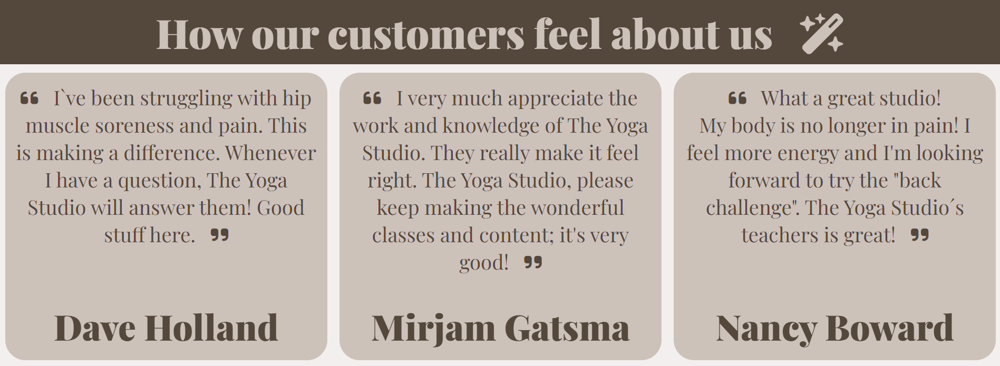
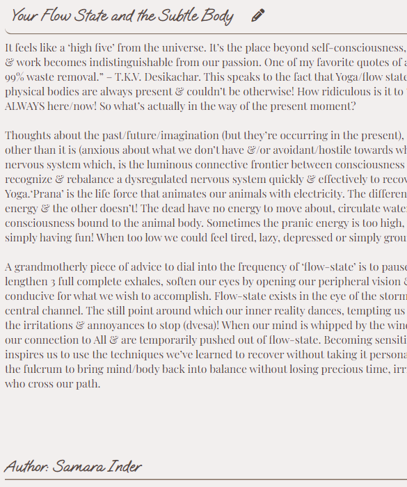

# **The Yoga Studio**

The Yoga Studio website is a inspirational page for a yoga studio based in a small town in Sweden.  
The yoga studio is a warm, serene and hospitable studio with a clear mission - to make everyone feel welcome and  
well taken care of - regardless of age or disabilities.   
  
  
Users of the webpage will be able to find inspiration through the studio gallery, blog posts from our teachers, and  
reading customer reviews. Users will easily find location, contact and booking information at the bottom of page in  
form of address, booking form, contact info and clickable social media links. This website is to increase the awerness  
of The Yoga studio´s existence and for anyone looking to start their yoga journey and lives near the studio's location. 

---
## **Features** 

### **Navigation**  

 * The top of the page shows the studio name, a clickable link that takes the user back to the homepage.
 * To the right of the navigation user can find links to the home, blog and gallery pages.
 * The navigation has a dark font and a lighter background for good contrast.
 * The studio name has a bigger font than the navigation bar to clearly state the studio and webpage's name.

 

### **Main section**

* The main section gives users a glimpse of the studio through a large photo of two women training in a serene environment.
* The main text is a short introduction to the yoga studio.
* Under the intriguing main text is a clickable read more button that takes users to about section further down the page. 

### **About section**
* The about section gives the users more information about the studio and location.
* This section provides the user with information about the studio, what the goal of the studio is and who the yoga classes are for - everybody! 
* The same woman from the main section occurs in this section to maintain a common thread.

### **Customer reviews**

* The customer reviews aim to increase the user's need for a visit to the studio by showing three happy clients' reviews.
* The goal is to reinforce to the user that the studio is worth a visit.
* The colors from the main section recur here to create a good balance between sections.

### **Contact section**

* The contact section provides the user with a location to join The Yoga Studio.
* This section also gives the user contact information to call or email.
* The user will have the option to book a session at the studio through the booking form.
* The page matches the colors from the about section with the same box style.

### **Footer section**
* The footer section is linked with all social media platforms the studio is connected to.
* The page links to Facebook, Instagram, Twitter and Youtube and a new tab opens when clicked.
* The colors from the header at the top, matches the colors in this section at the bottom of page - to create a nice frame to page.

## **Blog page**

### **Blog preview**

* The blog navigation link from the home page redirects user to the blog page.
* In the blog main page a preview of three blog posts can be seen, the whole area round the previews is clickable and redirects users to the full blog posts in other pages.
* The blog preview page is arrenged to fit in with colors from the home page.
* The magnifying glas icon is used to hint to users that the area is a clickable link that will redirect them.

### **Full blog post pages**

* The full blog post pages matches the webpage with colors. 

## **Gallery**

* Matching photos is combined in one page to give inspiration to users.
* The gallery is responsive and changes from 4 columns - to three - to two and lastly to one in small devices.

---

## **Testing**

| **Action** | **Result** |
| ---------- | ---------- |
| Test webpage on diffrent browsers | I tested that the page works in diffrent browsers such as Chrome, firefox and Microsoft Edge. |
| Test that webpage is responsive | I confirmed that this project is responsive, looks good and functions on all standard screen sizes using the devtools device toolbar. |
| Webpage text is readable | I confirmed that the header, navigation, main, about us, reviews, footer, gallery and blog pages text are all readable and easy to understand. |
| Test webpages links  |  I have confirmed that the links between diffrent pages work and are accessible.  |

## **Bugs**

* When I deployed my project to Github pages I discovered my project was broken, the links to the other files (CSS, blog and gallery) dit not work. I discovered this was because I had used absolute file paths in my code.  
When I removed the / from the start of the path the problem was fixed.

---

## **Validator testing**

* HTML  
  
Four errors occured for the blog page since I used h1-headings on three occations i blog.html, when I replaced them the errors disapeared. One warning in Gallery page due to section without heading,  
solved that by adding a div element and removing section. From the home page one error remains due to a bug. See *unfixed bug section*. The errors were fixed and all pages besides the home page passed validation afterwards.
  
**Home page**  
  

**Blog page**  
  

**Blogpost one**  
  

**Blogpost two**  
  

**Blogpost three**  
  

**Gallery page**   

* CSS
No errors were found when passing through the official (Jigsaw) validator.  

* Accessability
I confirmed that the colors and fonts chosen are easy to read and accessible by running it through lighthouse in devtools.

---

### **Unfixed Bugs**

* One remaining bug due to the option element "Element option without attribute label must not be empty."  
I've tried to apply a label for each option and remove text in between - same error. Tried to removing space between text - same error. Seems to be a bug.  

 

  

---

## **Deployment**

The site was deployed to GitHub pages. The steps to deploy are as follows:
* In the GitHub repository, navigate to the settings tab.
* From the source section drop-down menu, select the Master Branch.
* Once the master branch has been selected, the page provided the link to the completed website.

The live link can be found here - [The Yoga Studio](https://thereslundqvist.github.io/The-Yoga-Studio/)

---

## **Credits**

### **Content**

* The text for the about section is copied and translated from [Hot Yoga - Stockholm](https://www.hotyogasthlm.se/)
* The customer reviews was copied from [Trustpilot](https://www.trustpilot.com/review/www.yogabody.com)
* Icons for about, reviews, social media icons and blog headers are from [Font Awesome](https://fontawesome.com/)
* The blogposts are copied from [Mind Oasis](https://mindoasis.org/)

### **Media** 

* The images was all downloaded from [Pexels](https://www.pexels.com/sv-se/)

